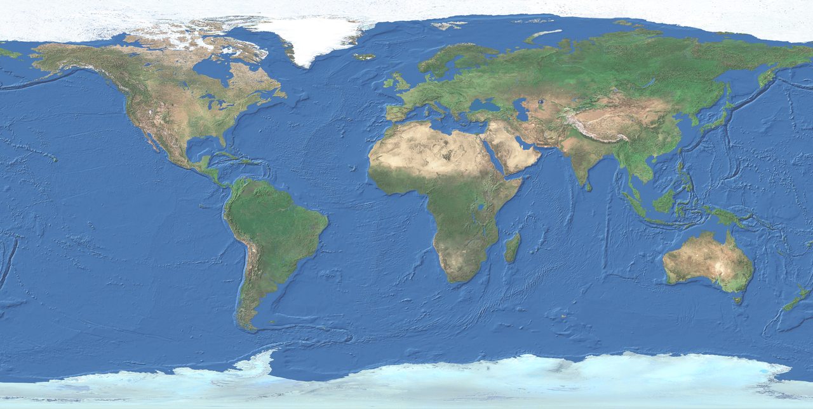

# Сломанная карта

В решении две проблемы.

## Проблема 1 - работа с `ref` без `.value`

При работе с реактивными переменными `ref` нужно работать со значением через свойство `.value`:

```js
// Неверно
let x = ref(0)
let y = ref(0)
x = event.offsetX
y = event.offsetY
map.style.left = `${x}px`
map.style.top = `${y}px`

// Верно
const x = ref(0)
const y = ref(0)
x.value = event.offsetX
y.value = event.offsetY
map.style.left = `${x.value}px`
map.style.top = `${y.value}px`
```

## Проблема 2 - прямое манипулирование DOM вместо определения шаблона

В Vue за редкими исключениями нельзя манипулировать DOM напрямую.

Даже если такое решение работает, оно сложнее для понимания. Шаблон описывает элемент одним образом, а на странице он
уже работает другим (имеет какие-то стили). При этом такое решение легко сломать, например, если компонент
перерендерится.

Требуется либо явно описать `style` в шаблоне через привязку с `v-bind`.

```html
<!-- Не забудьте, что в шаблоне обращаться через `.value` уже не нужно -->
<!-- Не забудьте, что вложенные шаблонные строки нужно экранировать -->
<span
  class="pin"
  :style="{
  left: \`\${x}px\`,
  top: \`\${y}px\`,
}"
  >📍</span
>
```

Либо описать вспомогательное вычисляемое свойство и использовать его в шаблоне.

```js
const pinPositionStyle = computed(() => ({
  left: `${x.value}px`,
  top: `${y.value}px`,
}))
```

```html
<span class="pin" :style="pinPositionStyle">📍</span>
```

## Полное решение

```js
import { computed, defineComponent, ref } from 'vue'

export default defineComponent({
  name: 'MapApp',

  setup() {
    // Реактивные переменные для хранения координат метки
    const x = ref(0)
    const y = ref(0)

    /**
     * Обработчик клика по карте для установки координат метки
     * @param {MouseEvent} event
     */
    function handleClick(event) {
      x.value = event.offsetX
      y.value = event.offsetY
    }

    // Для удобства вынесем вычисление стиля позиционирования в отдельное вычисляемое свойство
    // Можно обойтись и без вычисляемого свойств, сразу прописывая стили в шаблоне
    const pinPositionStyle = computed(() => ({
      left: `${x.value}px`,
      top: `${y.value}px`,
    }))

    return {
      pinPositionStyle,
      handleClick,
    }
  },

  template: `
    <div class="map" @click="handleClick">
      
      <span class="pin" :style="pinPositionStyle">📍</span>
    </div>
  `,
})
```
